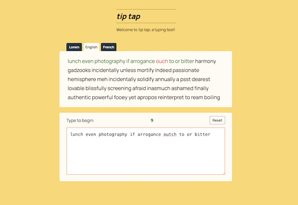

# tiptap

A typing speed test.

Created with Svelte & SvelteKit and Faker.js.

*Code still in progress*

## Introduction

I built tiptap as my take on a typing speed test, for fun, and also to try out using Svelte to build something interesting.

## Goals

My main goal was to explore how I might address certain issues I personally have found irksome in other typing speed tests I've tried, mainly surrounding the split-second UI cues in the actual text mid-test that communicate success and error states.

I also wanted to offer at least a few customization options to give some range in terms of difficulty level, so I added sample text in several languages and also a few different timer durations to choose from.
